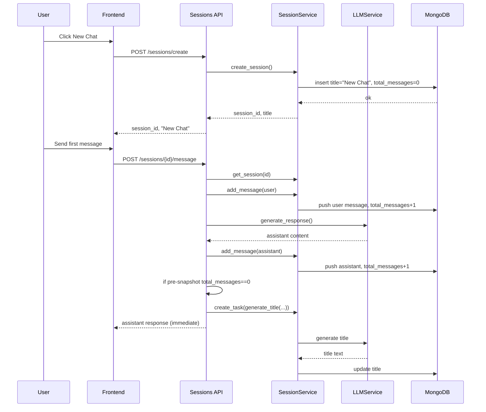

# Auto Session Naming Documentation

## Purpose
This document explains exactly how automatic session naming works in this codebase, including:
- When a session is created
- When and how the title changes from `New Chat`
- What the backend and frontend each do
- Edge cases and current gaps
- A reusable blueprint for future projects

## Current Behavior Summary
- New sessions are created with a default title: `New Chat`.
- Auto naming is triggered only after the first full exchange (user message + assistant response).
- Title generation runs asynchronously in the background and does not block chat response delivery.
- If title generation fails, fallback naming uses the first four words of the first user message.

## Code Locations
- Backend session service: `backend/services/session_service.py`
- Backend session router: `backend/routers/sessions.py`
- Frontend session API client: `src/api/sessions.ts`
- Frontend session state store: `src/store/sessionStore.ts`
- Frontend chat flow: `src/components/ChatInterface.tsx`
- Frontend sidebar rendering: `src/components/SessionSidebar.tsx`

## End-to-End Lifecycle

### 1) Session creation
When user clicks New Chat (`src/components/SessionSidebar.tsx`), app navigates to `/chat/new`.

In `src/components/ChatInterface.tsx`, route `/chat/new` triggers:
1. `createSession(backend, model, config)` from `sessionStore`
2. `sessionApi.createSession()` calls `POST /api/sessions/create`
3. Backend `SessionService.create_session()` writes a new DB record with:
   - `title: "New Chat"`
   - `messages: []`
   - `metadata.total_messages: 0`
4. Frontend navigates to `/chat/{session_id}`

### 2) First user message
In `src/components/ChatInterface.tsx`, submit sends:
- `POST /api/sessions/{session_id}/message`

In backend `send_message` (`backend/routers/sessions.py`):
1. Loads session
2. Saves user message via `SessionService.add_message(...)`
3. Calls LLM for assistant response
4. Saves assistant message via `SessionService.add_message(...)`

### 3) Auto-title trigger
After saving assistant message, backend checks:
- `if session["metadata"]["total_messages"] == 0:`

Important detail:
- `session` is the pre-send snapshot loaded before message inserts.
- For a brand-new session, this value is `0`.
- Therefore, auto-title runs only on the first exchange.

Then backend starts non-blocking background task:
- `asyncio.create_task(session_service.generate_title(...))`

### 4) Title generation logic
`SessionService.generate_title(...)` builds a prompt from:
- First user message
- First assistant response (first 200 chars)

It asks LLM for a concise title with exactly 3-4 words.

Post-processing rules:
1. Remove `Title:` prefix and quotes.
2. Keep max 4 words.
3. Keep max 50 characters.
4. If empty or too short (<3 chars), fallback to first 4 user-message words.
5. Persist title with Mongo update.

### 5) Fallback behavior
If LLM call throws any exception:
- Title falls back to first 4 words of the user message.
- Fallback is still persisted.

This guarantees every first exchange gets some non-default title.

## Sequence Diagram


## Data Contracts

### Session creation response
From `POST /api/sessions/create`:
```json
{
  "session_id": "uuid",
  "title": "New Chat"
}
```

### Session DB shape relevant to naming
```json
{
  "session_id": "uuid",
  "title": "New Chat or generated title",
  "messages": [...],
  "metadata": {
    "total_messages": 0
  }
}
```

## Observed Gaps and Risks

### 1) `POST /sessions/{id}/generate-title` currently mismatched
In `backend/routers/sessions.py`, endpoint calls:
- `session_service.generate_title(session_id, first_message)`

But service signature requires:
- `generate_title(session_id, user_message, assistant_response, backend, model)`

Impact:
- Manual generate-title endpoint is likely broken (argument mismatch) unless refactored.
- Auto-title path still works because `send_message` passes all required arguments.

### 2) Sidebar title refresh is not immediate after background rename
`SessionSidebar` fetches sessions on mount, and `createSession` refreshes once at creation time.
After first message auto-renames in backend, frontend does not immediately refresh session list.

Impact:
- User may still see `New Chat` until sidebar refresh/reload or another fetch trigger.

### 3) Prompt asks exactly 3-4 words, but enforcement is max 4 only
Current code truncates to first 4 words, but does not enforce minimum 3 words except a generic min length check.

Impact:
- Generated titles can be 1-2 words if model outputs that and string length >= 3.

## Reusable Pattern for Future Projects

Use this design if you want reliable auto naming with minimal user friction.

### Backend rules
1. Initialize session with default title (`New Chat`).
2. Trigger auto-name only once, after first full exchange.
3. Run title generation asynchronously so chat response is not delayed.
4. Apply deterministic cleanup and guardrails:
   - Strip noise/prefixes
   - Word cap
   - Character cap
5. Always have fallback naming from user text.

### Frontend rules
1. Show default title immediately after session creation.
2. Poll or refetch session list after first exchange, or subscribe to server event.
3. Optimistically update title when rename result is detected.

### Recommended API shape
- Keep message endpoint as source of truth:
  - Option A: include `session_title` in first-response payload if available.
  - Option B: emit websocket/sse event `session_title_updated`.
- If exposing manual `/generate-title`, keep signature aligned with service contract.

## Implementation Checklist
- [ ] Create session with placeholder title.
- [ ] Save first user and assistant messages before naming.
- [ ] Trigger naming with first-exchange guard.
- [ ] Make naming async/non-blocking.
- [ ] Add robust fallback.
- [ ] Persist generated title.
- [ ] Ensure UI refresh path for updated title.
- [ ] Add tests for success + failure fallback + first-exchange-only behavior.

## Suggested Tests
- Unit: title post-processing (prefix stripping, truncation).
- Unit: fallback path when LLM fails.
- Integration: first message triggers rename once only.
- Integration: subsequent messages do not re-trigger auto-title.
- UI: sidebar updates from `New Chat` to generated title without full reload.

## Practical Notes for This Repo
- Auto naming is implemented and active through `POST /api/sessions/{id}/message`.
- Existing manual generate-title endpoint should be fixed before relying on it.
- To improve UX, trigger `fetchSessions()` after the first assistant response or on a short interval after send.
